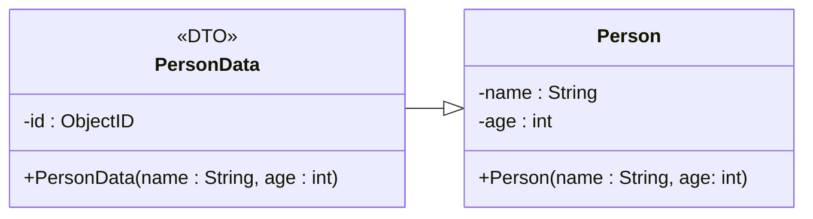

## 01 . Introduction

Récupérez votre premier projet.

Récupérez le serveur portable MongoDB sur [https://iutdijon.u-bourgogne.fr/intra/info/softs/](https://iutdijon.u-bourgogne.fr/intra/info/softs/) (si le lien ne fonctionne pas, voir avec votre enseignant) et décompressez l’archive dans un espace accessible en écriture (votre dossier documents, le bureau, comme vous voulez). Créez un sous-dossier data dans ce dossier (ou ailleurs, peu importe, du moment que vous ayez un accès en écriture) : ce dossier servira à stocker vos bases de données.

Ouvrez dans le dossier MongoDB un terminal et exécutez le serveur par la commande suivante :

```bash
.\bin\mongod.exe --dbpath data
```

Laissez le terminal ouvert quand vous codez pour que le serveur soit disponible en permanence.

Rajoutez l’extension MongoDB for VSCode à Visual Studio Code. Ouvrez l’extension et configurez la connexion au serveur local avec la chaîne de connexion standard (mongodb://localhost)

Il ne reste plus qu’à rajouter dans le projet du sujet précédent (que vous avez bien récupéré… on ne va pas tout refaire) les dépendances nécessaires à l’utilisation de MongoDB dans notre webapi.

Ouvrez le fichier pom.xml et rajoutez, dans le nœud \<dependencies\> la valeur suivante :

```xml
<dependency>
	<groupId>org.springframework.boot</groupId>
	<artifactId>spring-boot-starter-data-mongodb</artifactId>
</dependency>
```

Enregistrez le fichier. Visual Studio Code devrait vous demander de synchroniser le projet, acceptez !

Testez que tout va bien en exécutant le serveur.
## 02 . Utilisation simple de la BDD MongoDB

Nous allons déjà, dans notre TD, une classe DTO (Person) qui stocke une personne. Nous allons gérer la **persistance** des personnes au moyen d’une table MongoDB.

Une table MongoDB (un « document ») doit être reliée à une classe particulière qui, en plus des données, possède un champ servant **d’identifiant** (clé primaire).

Nous n’allons pas modifier la classe `Person` (qui peut être utilisée dans d’autres cas) mais créer une classe qui en **hérite** pour lui rajouter les informations nécessaires.

Il faut donc créer une classe `PersonData` qui va **hériter** de personne et lui rajouter un **identifiant**. Son modèle est défini par le diagramme ci-dessous :



Vous remarquerez que nous avons rajouté une propriété Id : cette propriété servira d’identifiant (nous devons absolument avoir un identifiant pour une table mongoDB). Nous allons choisir le type org.bson.types.ObjectID qui permet de créer des identifiants uniques de manière assez simple (une alternative serait un autoincrément).

<!-- Saut de page-->
<div style="page-break-after: always;"></div>

La classe doit être **annotée** : Document fixe le nom du document MongoDB (l’équivalent d’une table) et TypeAlias le nom du type associé (si on ne le précise pas, il utilise le type avec le nom du package et ceci empêche de le déplacer ou de le renommer).

```java
@Document("Person") 
@TypeAlias("PersonData")
public class PersonData extends Person
// Attention à l'annotation:
    @Id
    private ObjectId id;

    public String getId(){return this.id.toHexString();}

    public PersonData(String name, int age)
    {
        super(name,age);
        id = ObjectId.get();
    }
```

Il faut également rajouter un **constructeur** **par défaut** car le framework en a besoin.

Notre classe DTO est donc prête, il nous reste à faire la classe servant de « DAO » pour cette dernière.

Créez dans votre projet un sous-dossier `📁repositories` et, dans ce dossier, un fichier `PersonRepository.java`.

Placez y l’interface suivante (elle est vide, c’est normal) :

```java
@Repository
public interface PersonRepository extends MongoRepository<PersonData,ObjectId> {
}
```

L’annotation indique à Spring Boot que cette interface est un **dépôt de données**. Elle hérite d’une interface standard (MongoRepository) générique. Le type `PersonData` indiqué est le type stocké, et le 2ème paramètre de type est le type de l’identifiant.

L’interface `MongoRepository` définit déjà les opérations les plus utiles, donc il n’y a rien de particulier à coder !

Créez, dans le dossier `📁services`, une classe `PersonServices` (remarquez l’annotation) :

```java
@Service
public class PersonService {
    private PersonRepository repository;
    public PersonService(PersonRepository repository){
        this.repository = repository;
    }
    public PersonData add(String name, int age){
        PersonData pdata = new PersonData(name,age);
        repository.insert(pdata);
        return pdata;
    }
}
```

Créez, dans le dossier `📁controllers`, une classe `PersonController` :

```java
@RestController
public class PersonController {
    private PersonService service;
    public PersonController(PersonService service){
        this.service = service;
    }

   @PostMapping("/person/add")
   public PersonData postMethodName(@RequestBody Person person) {
      PersonData p = service.add(person.getName(), person.getAge());
      return p;
   }

}
```

Testez, avec Thunder Client, l’appel de la requête POST (indiquez bien une personne dans le corps de la requête) et vérifiez, avec l’extension MongoDB, que la personne est bien ajoutée dans la base.

<!-- Saut de page-->
<div style="page-break-after: always;"></div>
--

## 03 . Utilisation de l'interface standard

En utilisant l’interface standard du MongoRepository, créez les API suivantes (à chaque fois il faudra créer une opération dans le contrôleur et une dans le service) :

- Lister toutes les personnes de la base
- Lister une personne à partir de son ID (à partir de sa « trace » chaine)
- Supprimer une personne à partir de son ID
- Vider la base (supprimer toutes les personnes)

## 04 . Interface personnalisée

L’interface standard possède un grand nombre de méthodes, mais dans certains cas elle est insuffisante.

Il est possible de rajouter facilement des opérations en indiquant la requête MongoDB à effectuer.

Rajoutez l’opération suivante dans `PersonRepository` (elle permet de lister l’ensemble des personnes en effectuant une recherche sur leur nom : remarquez que nous ne donnons pas son code, uniquement son interface) :

```java
    @Query("{name:'?0'}")
    List<PersonData> findPersonByName(String name);
```


Rajoutez dans la classe service une opération pour lister les personnes du dépôt suivant leur nom, et dans le contrôleur une réponse à l’API `/person/findByName` qui l’utilise. Testez !

Faites de même une opération permettant de fournir la liste des personnes dont l’âge est compris entre deux valeurs. Pour plus de détails concernant la syntaxe à utiliser dans l’annotation @Query, voir [Spring Data MongoDB - Guide to the @Query Annotation (stackabuse.com)](https://stackabuse.com/spring-data-mongodb-guide-to-the-query-annotation/)

<!-- Saut de page-->
<div style="page-break-after: always;"></div>
--

## 05 . Interface encore plus personnalisée

L’interface MongoRepository fournit un grand nombre d’opérations, et il est possible d’en rajouter comme nous venons de le voir facilement grâce à l’annotation @Query.

Il est en outre possible de personnaliser encore plus en créant directement le code MongoDB nécessaire à une requête particulière, si l’interface standard est insuffisante.

Imaginons, par exemple, que nous souhaitons augmenter de 1 l’âge de toutes les personnes de la base. Difficile à faire avec les opérations standard, mais possible en utilisant directement les fonctions MongoDB.

Pour cela, nous allons créer, dans le dossier repositories, notre propre interface pour le dépôt, contenant une seule opération :

```java
public interface PersonCustomRepository {
    void updateAgeAll();
}
```

Modifiez ensuite `PersonRepository` pour qu’elle hérite également de cette interface :

```java
@Repository
public interface PersonRepository extends MongoRepository<PersonData,ObjectId>, PersonCustomRepository  {
```

<!-- Saut de page-->
<div style="page-break-after: always;"></div>

Il ne reste plus qu’à coder l’opération elle-même, dans une classe qui implémentera l’interface personnalisée. Cette classe sera **nommée** et **annotée** pour que Spring Boot gère **automatiquement** son instanciation :

```java
@Component
public class PersonCustomRepositoryImpl implements PersonCustomRepository{
    private final MongoTemplate mongoTemplate;
    public PersonCustomRepositoryImpl(MongoTemplate template){
        this.mongoTemplate = template;
    }
    @Override
    public void updateAgeAllPersons() {
        Query query = new Query();
        Update update = new Update();
        update.inc("age",1);
        UpdateResult result = mongoTemplate.updateMulti(query, update, PersonData.class);
        if(result==null)
            throw new RuntimeException("No persons to update");
    }
}
```

Rajoutez bien évidemment une opération dans le service et une requête PATCH dans le contrôleur et testez cette opération.

## 06 . Un contrôleur, plusieurs services

Pour effectuer cet exercice, commencez par vider la base de son contenu (nous allons modifier la structure d’une personne).

Nous allons rajouter, dans Person (donc dans `PersonData`, donc dans la base de données) un champ photo de type String qui contiendra le nom d’un fichier contenant une image.

L’image sera stockée dans le dossier utilisé précédemment pour gérer les photos.

Modifiez le nécessaire pour que l’application fonctionne avec ce champ supplémentaire. Ajoutez une ou deux personnes dans la base (et n’oubliez pas de placer les fichiers image nécessaires dans le dossier adéquat).

Nous souhaitons avoir, dans le contrôleur, une opération GET qui fournit l’image d’une personne à partir de son ID. Implémentez cette opération en utilisant les services existants (vous n’avez normalement pas besoin de modifier une classe service ni une classe repository).