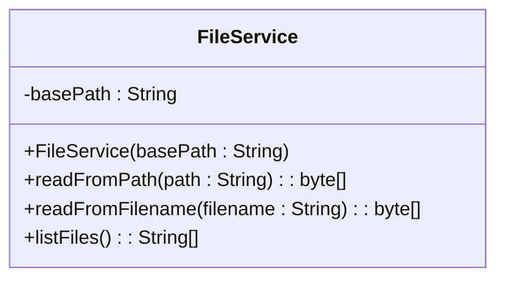

Spring Boot est un framework Java permettant de réaliser des WebAPI d’une manière efficace, simple et fonctionnelle. C’est un des frameworks web les plus utilisés en entreprise.

Nous allons lors de ce TD découvrir les fonctionnalités de base de cet outil.

## 01 . Configuration des outils

Spring Boot n’est pas lié à un EDI en particulier et peut être utilisé sur différents environnements. Nous utiliserons **Visual Studio Code**, et **Java 17**. Les raccourcis sont considéré pour Windows

Installez les extensions suivantes :

- Spring Boot Extension Pack
- Thunder client ou Postman
- Extension pack for Java

## 02 . Création du premier projet

Spring Boot fournit un **assistant** pour créer un projet. Vous pouvez utiliser l’assistant en ligne (vous aurez alors un .zip à télécharger contenant votre projet) ou directement depuis Visual Studio Code (le projet est alors créé     dans le dossier courant).

Dans Visual Studio Code, tapez CTRL+Maj+P pour avoir la palette de commandes, et tapez la commande « Spring Initializr : Create a maven project ».

Spécifiez la version 3.2.X, le langage Java, choisir un préfixe comme fr.iut, puis un nom simple pour le projet (minuscules, sans espace, nom court, td01 par exemple). Spécifiez un package type JAR et la version 17 de Java. Vous avez ensuite une liste de dépendances possibles, pour l’instant ne choisir que « Spring Web ». Vous aurez ensuite le choix du dossier où le projet sera généré. Ouvrez ensuite Visual Studio Code dans ce dossier pour être à la racine de votre projet.

<!-- Saut de page-->
<div style="page-break-after: always;"></div>

Vous devriez avoir une arborescence similaire à :

```text
📦votre dossier
 ┣ 📂.mvn
 ┣ 📂.vscode
 ┣ 📂src
 ┣ 📜.gitignore
 ┣ 📜HELP.md
 ┣ 📜mvnw
 ┣ 📜mvnw.cmd
 ┗ 📜pom.xml
```

## 03 . Un premier contrôleur simple

Notre projet est une WebAPI, donc doit posséder un certain nombre de points d’entrée (endpoints). La classe qui gère ces différents points d’entrée s’appelle un **contrôleur** en Spring Boot.

Créez dans le dossier `src/main/java/fr/iut/td01` (le dossier contenant le fichier XXApplication.java) un sous-dossier controllers et dans ce dossier, un fichier HelloController.java qui contiendra la classe HelloController. Cette classe doit avoir l’annotation @RestController, ce qui indique à Spring Boot son rôle. Nous allons ajouter une opération helloWorld, correspondant à la requête GET `/hello`, qui renverra simplement un texte.

Votre classe doit ressembler à :

```java
@RestController
class HelloController
{
    @GetMapping("/hello")
    public String helloWorld(){
        return "Hello, world !";
    }
}
```

Ouvrez à présent l’extension « Spring Dashboard » présente dans la barre d’outils latérale. Vous devriez voir un aperçu de votre application (si Visual Studio Code vous demande d’activer des extensions, acceptez).

<!-- Saut de page-->
<div style="page-break-after: always;"></div>

Vous pouvez exécuter l’application pour tester votre API ; vous devriez avoir, dans le terminal, un affichage similaire à :

```text
2024-02-23T17:04:40.159+01:00  INFO 31700 --- [           main] o.s.b.w.embedded.tomcat.TomcatWebServer  : Tomcat initialized with port 8080 (http)
2024-02-23T17:04:40.170+01:00  INFO 31700 --- [           main] o.apache.catalina.core.StandardService   : Starting service [Tomcat]
2024-02-23T17:04:40.170+01:00  INFO 31700 --- [           main] o.apache.catalina.core.StandardEngine    : Starting Servlet engine: [Apache Tomcat/10.1.18]
2024-02-23T17:04:40.219+01:00  INFO 31700 --- [           main] o.a.c.c.C.[Tomcat].[localhost].[/api]    : Initializing Spring embedded WebApplicationContext
2024-02-23T17:04:40.220+01:00  INFO 31700 --- [           main] w.s.c.ServletWebServerApplicationContext : Root WebApplicationContext: initialization completed in 979 ms
```

Le serveur est à présent lancé, vous pouvez y accéder avec un navigateur ou avec Thunder Client en utilisant l’URL [http://localhost:8080/hello](http://localhost:8080/hello). N'oubliez pas de sélectionner le verbe GET si celui-ci n'est pas défini par défaut.

## 04 . Requête GET avec paramètre simple

Rajoutez dans le contrôleur une opération qui répond à la requête `/hi` qui, elle, possède un paramètre name (une chaîne de caractères) en renvoyant une chaîne « Hi <\name\> ! ».

Testez avec un navigateur ou, mieux, avec Thunder Client !

<!-- Saut de page-->
<div style="page-break-after: always;"></div>

## 05 . Requête GET avec un objet en retour

Utiliser des types de base (String, int) c’est bien, mais utiliser un objet, c’est mieux !

Créez un sous-dossier models dans java/fr/iut/td01, et un fichier Person.java dans ce dossier. La classe sera un simple PODO (plain old data object) contenant deux champs :

```java
public class Person {
    private String name;
    private int age;

    public Person(String name, int age){
        this.name=name;
        this.age=age;
    }

    public String getName(){
        return name;
    }

    public int getAge(){
        return age;
    }
}

```

Rajoutez dans le contrôleur une réponse à la requête `/whois` qui renvoie une personne contenant le nom « toto » et qui a 15 ans. Testez avec Thunder Client.

Remarquez le format utilisé pour renvoyer l’objet (nous n’avons rien précisé normalement).

## 06 . Requête POST avec un objet en paramètre.

Pour envoyer un objet, notamment dans le but de l’ajouter au serveur, il faut utiliser POST et non GET.

Créez dans le contrôleur une réponse à la requête POST `/IAm` qui fournit une personne au contrôleur et qui renvoie une simple chaîne « you are \<name\> and you’re \<age\> years old ». Cette fois le paramètre sera transmis par le **corps** de la requête (body) ce qui oblige à préfixer le paramètre par @RequestBody dans l’opération.

Testez avec Thunder Client et un corps correspondant au format vu plus haut.
## 07 . Requête renvoyant une image des ressources

Il est assez simple d’envoyer une **image** (ou tout autre fichier) si celle-ci est présente dans les **ressources**.

Créez un sous-dossier images dans le dossier ressources. Placez y une image quelconque au format JPEG.

Créez dans le contrôleur une opération qui répond à la requête GET /image et renvoie une réponse de type tableau d’octets (byte[]) dans le corps de la réponse (il faut donc annoter la valeur de retour par @ResponseBody). Pour préciser que la réponse est une image JPEG (et non un BLOB brut) il faut modifier l’annotation GetMapping :

```java
@GetMapping(value="/image", produces = MediaType.IMAGE_JPEG_VALUE)
```


Pour charger un fichier des ressources dans un tableau d’octets, utilisez le code suivant (remplacez test.jpg par le nom de votre fichier) :

```java
InputStream stream = getClass().getResourceAsStream("/images/test.jpg");
byte[] bytes = stream.readAllBytes();  
```


Testez avec un navigateur ou Thunder Client !

## 08 . Requête liées a un dossier

Nous souhaitons réaliser une requête pour lister les fichiers contenus dans un dossier particulier du serveur (par exemple le dossier Images).

Créez une requête GET qui renvoie un tableau de chaînes de caractères contenant les noms de tous les fichiers d’un dossier particulier (choisir un dossier local, avec un chemin absolu dans le code, contenant quelques fichiers images).

<!-- Saut de page-->
<div style="page-break-after: always;"></div>

Pour lister les fichiers d’un dossier, vous pouvez utiliser le code suivant :

```java
ArrayList<String> imageNames = new ArrayList<>();
File folder = new File("C:\\TEMP\\");
File[] files = folder.listFiles();
for(File file : files){
	if(file.isFile()){
		imageNames.add(file.getName());
	}
}
```

Testez votre requête.

Réalisez ensuite une requête `/get_img` qui prend un paramètre **file_name** (une chaîne) et renvoie l’image correspondante (un tableau d’octets). Pour lire un fichier sur le système de fichiers local (et non depuis les ressources) :

```java
byte[] bytes=null;
try(FileInputStream stream = new FileInputStream(<path of file>))
{
	bytes = stream.readAllBytes();
}
```

Testez !

## 09 . Requête liées a un dossier

Nos  3 dernières requêtes (celles qui gèrent les fichiers) font trop de choses : en effet, le rôle du contrôleur n’est PAS de fournir le service mais uniquement de répartir les requêtes entrantes.

Créez donc, dans un dossier `java/fr/iut/services` une classe `FileService` qui réunira les opérations nécessaires liés aux fichiers (voir modèle ci-contre) et modifiez le contrôleur pour qu’il l’utilise. 

Voici pour vous aidez un diagramme de la classe `FileService`



Vous remarquerez un **paramètre** dans le constructeur. Spring Boot permet de facilement lire ce paramètre depuis le fichier `applications.properties`.

Éditez ce fichier et rajoutez la ligne suivante (adaptez à votre chemin) :

```text
images_path=c:\\temp\\cbz\\
```


Pour lier le paramètre du constructeur à ce paramètre, il suffit de faire :

```java
public FileService(@Value("${images_path}") String path){
```


Pour que Spring Boot crée **automatiquement** l’instance concernée, il faut annoter la classe `FileService` par @Service.

Rajoutez ensuite dans le contrôleur un attribut de type `FileService` et un constructeur prenant un `FileService` en paramètre pour initialiser cet attribut. Le constructeur sera automatiquement appelé par Spring boot.

Testez : le fonctionnement doit être identique, mais à présent le contrôleur n’a plus qu’un seul rôle.