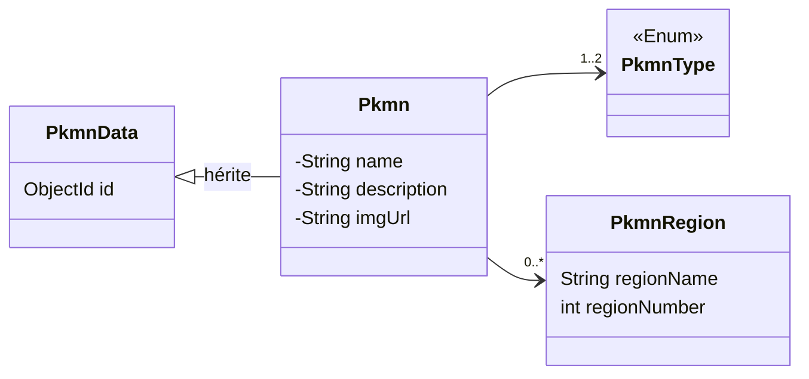

Notre API tourne, elle est sécurisé, on peut donc enfin travailler à créer nos Pokémons ! Le but de ce sujet sera de pouvoir gérer (entendre par la Create Read Update Delete) nos Pokémons. 

Le contenu sera moins dirigiste. Il posera les bases des choses à faire et vous aurez la responsabilité de le faire à votre manière.

## 01 . La data

Pour nous représenter un Pokémon dans le Pokédex. Nous allons partir d'un postulat simple. Celui-ci pourra évidemment être amélioré une fois la base terminé pour mieux répondre à l'idée de ce que vous voudriez en faire.

Un Pokémon sera représenté par :

- Un nom 
- Une image (ou du moins son url)
- Une description 
- Une liste de types (contenant 1 ou 2 élements)
- Une liste de Région (Un nom + un numéro de Pokédex dans cette région)

Si on prend en exemple Dracaufeu, cela pourrait donner ceci :

```json
{
  "_id": "65e0c265f52ffe0b2a171b5a",
  "name": "Charizard",
  "types": [
    "FIRE",
    "FLYING"
  ],
  "description": "desc",
  "regions": [{
            "regionName": "National",
            "regionPokedexNumber": 6
      }],
  "imgUrl": "https://archives.bulbagarden.net/media/upload/3/38/0006Charizard.png",
}
```


Je vous propose comme structure de code ce diagramme de classe (Il faudra ajouter les constructeurs/getters/setters qui vont bien) : 



A vous de jouer ! 

## 02 . Descriptions des fonctionnalités 

Comme prévus, je vais juste vous donner une description de ce que dois faire notre API et à vous de le coder. Si vous bloquez, n'hésitez pas à demander des conseils. Toute la gestion des Pokémon demandera au moins d'être authentifié ! 

N'hésitez pas à chercher sur internet les meilleurs codes HTTP à retourner selon les situations (erreur comme réussites)

### 2.1 Ajouter un Pokémon

Simple, il faut créer le Pokémon en base si celui-ci n'existe pas déjà. Actuellement, pour savoir si un Pokémon existe, il suffira de regarder si le nom existe ou non. 

Route : 

```text
POST /pkmn
```

Les input datas serait envoyé en form-data. Soit en multiples keys (recommandé) soit en une seul qui contiendrait tout le Pokémon en JSON.

La région étant un objet complexe, vous pouvez ne pas l'inclure dans les paramètres, nous auront une route pour ajouter une région à un Pokémon.

Output : Un `PkmnData` au format JSON. (Il faut que l'ID soit présent en tant que String). 

Une annotation sur votre champs ID permettra de le sérialiser : 

```java
@JsonSerialize(using= ToStringSerializer.class)
```

### 2.2 Ajouter une région à un Pokémon

Fonction : Ajoute un `PkmnRegion` à la liste du `Pkmn` puis le sauvegarde.

Input : Un formdata avec le nom de la région, le numéro du Pokémon pour cette région et l'ID du Pokémon

Output : Le `PkmnData` au format JSON.

Route : 

```text
POST /pkmn/region
```

### 2.3 Rechercher des Pokémons 

Fonction : Lister x Pokémons. Je vous demande de coder au moins 1 des critères. 

Input : 
- (optionnels) page et size. Pour éviter d'avoir tous les résultats d'un coup
- (optionnels) typeOne/typeTwo : Pour filtrer les Pokémons par types
- (optionnels) partialName : Une partie du nom du Pokémon


Output : Un objet JSON avec au moins une clé `data` comprenant la liste des Pokémons trouvé et une clé `count` qui dénombre les Pokémons

Route : 

```text
GET /pkmn/search?partialName=chari
GET /pkmn/search?typeOne=fire
GET /pkmn/search?page=1&size=20
```

### 2.4 Récupérer un seul Pokémon

Fonction : Avoir les infos d'un seul Pokémon soit par sont ID soit par son nom

Input : 
- id : L'id du Pokémon
- name : Le nom complet du Pokémon

Output : Le `PkmnData` au format JSON.

Route : 

```text
GET /pkmn?id=d7sqfg485f
```

### 2.5 Supprimer un Pokémon

Fonction : Supprimer le Pokémon à l'id fourni

Protection : Rôle ADMIN requis

Input : L'id du Pokémon

Output : No content (code 204)

Route : 

```text
DELETE /pkmn?id=d7sqfg485f
```

### 2.6 Modifier un Pokémon

Fonction : Modifier un Pokémon déjà existant. Si celui-ci n'est pas trouvé avec son ID, cela sera une erreur. Seul les champs modifié devront être fourni en plus de l'ID

Protection : Rôle ADMIN requis

Input : Les différents champs + l'ID

Output : Le `PkmnData` modifié au format JSON

Route : 

```text
PUT /pkmn?id=d7sqfg485f&typeOne=water
```

### 2.7 Supprimer une région d'un Pokémon

Fonction : Supprimé la région dont le nom est fourni pour un pokémon

Protection : Rôle ADMIN requis

Input : 
- regionName
- pkmnID

Output : Le `PkmnData` modifié au format JSON

```text
DELETE /pkmn/region?pkmnID=d7sqfg485f&regionName=kanto
```

## 03 . Tester le tout

Voila qui fera déjà pas mal de fonctionnalité. Je vous invite à tester le tout (en test manuel ou automatisé si vous avez le temps). Je vous recommande vraiment de faire une collection de Requests pour gagner du temps.

On pourrait évidemment rajouter des fonctionnalités (et vous le pouvez si vous le voulez) mais cela sera suffisant pour nous.