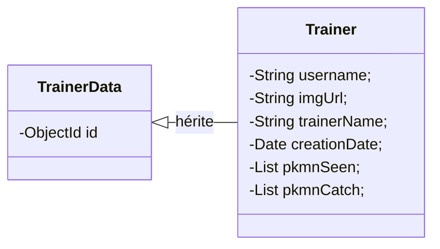

## 01 . Un jour je serais le meilleur dresseur !

L'objectif sera de gérer la partie Dresseur de notre API. Chaque utilisateur ne sera associé qu'a un seul dresseur. Dans un soucis d'éviter de modifier l'existant, nous partiront de l'idée que le `Trainer` contiendra le nom de l'utilisateur pour faire le lien (et vérifier s'il y a déjà une liaison ou non).

Le modèle `Trainer` sera donc implémenté avec plusieurs attributs :


N'oubliez pas de créer un constructeur vide en plus des constructeur avec paramètres ! 

La seconde étape sera de réaliser le CRUD (Create Read Update Delete) de notre modèle. Utilisez la route `/trainer` avec les différents verbes HTTP (POST,GET,PUT,DELETE) et celles-ci demanderont forcement d'être authentifié. Vu que l'on se basera sur l'utilisateur pour savoir quel `Trainer` gérer, pas besoin du rôle ADMIN

Petite aide pour récupérer les infos de l'utilisateur

```java
Authentication authentication = SecurityContextHolder.getContext().getAuthentication();
String username = authentication.getName();
```

<!-- Saut de page-->
<div style="page-break-after: always;"></div>
--

## 02 . Car il faut tous les attraper 

Pour terminer, créez une route qui va permettre d'ajouter un Pokémon (il faut vérifier qu'il est valide) à notre dresseur. A l'aide d'un paramètre, `isCaptured` par exemple, il vous permettra de savoir dans laquelle des 2 listes il faut l'ajouter (Vu ou capturé). 

Voici la route à utiliser  : `/trainer/mark`

Nous avons maintenant la base nécessaire pour notre API. Vous pourrez évidemment ajouter des suppléments qui vous paraitrons utiles pour votre appli front. 

Bien joué !

## 03 . Sacha et Pikachu : C'est fini

Vous avez fini et voulez aller plus loin ? Il manque une documentation à notre API. Les gens qui vont vouloir l'utiliser n'iront pas directement regarder le code ^^ Ceci est totalement un bonus :3

Pour une documentation simple et rapide, nous avons un protocole nommé OpenAPI et son implémentation commune Swagger ! 

Pour cela une petite libraire qui fait bien le travail et qui en 3 lignes fait 80% du travail 

[Springdoc](https://springdoc.org/#getting-started) 

Rien que faire le Getting started suffira à se lancer. Bon courage